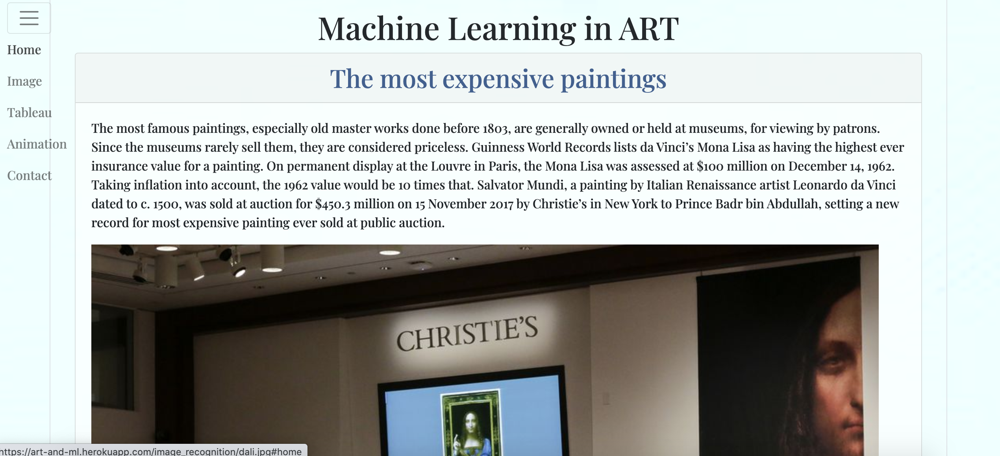
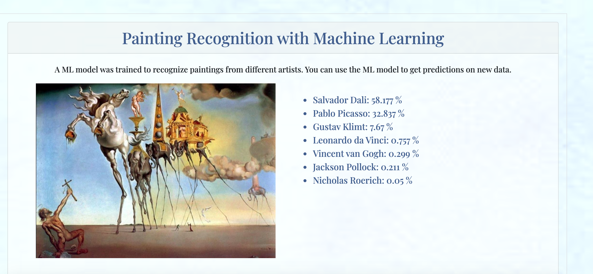

# Art-and-ML

The project idea was build on my Old Love for the Great Art and my New Love for Machine Learning. Flask App with an Image Recognition Model.

1.  BeautifulSoup used for web scraping, getting data and saving it on MongoDB Atlas (cloud database service)

2. The Training and Testing image datasets were created for 7 artists (Nicholas Roerich, Salvador Dali, Gustav Klimt, Vincent van Gogh, Leonardo da Vinci, Pablo Picasso, Jackson Pollock). ImageAI provides the most simple and powerful approach to training custom image prediction models. The final Model was trained for 48 hours. You can :
   1. Choose any img from imgTest folder
   2. Submit it and click the button 'Who is the artist?'
   3. Wait for predictions (less than 20 s)

1.  # Fast Style Transfer in TensorFlow

    Add styles from famous paintings to any photo in a fraction of a second!
    Originally from https://github.com/lengstrom/fast-style-transfer

    https://heartbeat.fritz.ai/set-up-almost-free-cloud-gpu-ml-model-training-on-google-colab-12b8b3a09020

    What is Style Transfer?
    Style transfer is, simply put, very much like a photo filter. But unlike those that you might find in a program like Photoshop, which use specific algorithms to manipulate a photo, style transfer attempts to identify the style of a source image on its own, with various groups of neurons working together to identify specific feature sets.

1.  # Searching and Downloading Google Images to the local disk

    Originally from https://github.com/hardikvasa/google-images-download

1.  # ImageAI provides the most simple and powerful approach to training custom image prediction models using state-of-the-art SqueezeNet, ResNet50, InceptionV3 and DenseNet

    Originally from https://github.com/OlafenwaMoses/ImageAI

1.  SHOW PICTURES IN YOUR TABLEAU TOOLTIP

    https://inviso.dk/blog/post/show-pictures-in-your-tableau-tooltip

1)  Tableau and Tableau insert

1)  Image Module (creating a GIF)
    The Image module provides a class with the same name which is used to represent a PIL image. The module also provides a number of factory functions, including functions to load images from files, and to create new images.

https://pillow.readthedocs.io/en/3.1.x/reference/Image.html

===============================================================

This project has :

- 2 ML models (Style Transfer model and Image recognition model),
- Flask
- MongoDB Atlas
- Web Scraping
- Tableau
- Images animation algorithm

