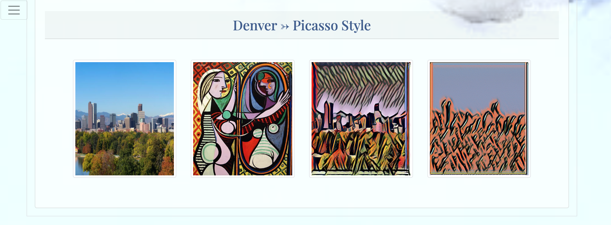

# Art-and-ML

The project idea was build on my Old Love for the Great Art and my New Love for Machine Learning. Flask App with an Image Recognition Model.

1.  BeautifulSoup used for web scraping, getting data and saving it on MongoDB Atlas (cloud database service)

2. The Training and Testing image datasets were created for 7 artists (Nicholas Roerich, Salvador Dali, Gustav Klimt, Vincent van Gogh, Leonardo da Vinci, Pablo Picasso, Jackson Pollock). Searching and Downloading Google Images to the local disk - Thank you to https://github.com/hardikvasa/google-images-download).
   ImageAI provides the most simple and powerful approach to training custom image prediction models. Thank you to https://github.com/OlafenwaMoses/ImageAI. The final Model was trained for 48 hours.
   1. Choose any img from imgTest folder
   2. Submit it and click the button 'Who is the artist?'
   3. Wait for predictions (less than 20 s)

3. Based on prediction - collecting data about the artist from dataset and displaying it on the app.

4. Embedded Tableau Story - By visually creating logical relationships between tables.

5. Style Transfer in TensorFlow - use specific algorithms to manipulate a photo, style transfer attempts to identify the style of a source image on its own, with various groups of neurons working together to identify specific feature sets. Thank you to - https://github.com/lengstrom/fast-style-transfer.

6. Creating GIFs with the Image module. Style Transfer had 40 steps/images to transfer Art Style to the Denver img. Those images were used for the GIFs.

